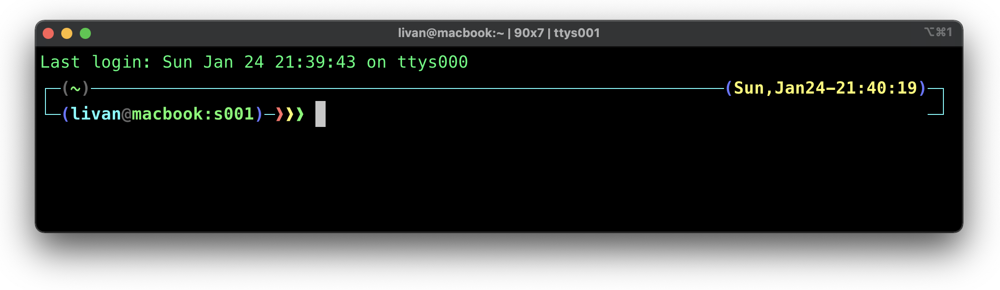

# zshconfig
My personal configuration of zsh shell.

## Prerequisites
- A Unix-like operating system: macOS, Linux, BSD. On Windows: WSL2 is preferred, but cygwin or msys also mostly work.
- [Zsh](https://www.zsh.org/) should be installed (v4.3.9 or more recent is fine but we prefer 5.0.8 and newer). If not pre-installed (run §zsh --version` to confirm), check the following wiki instructions here: [Installing ZSH](https://github.com/ohmyzsh/ohmyzsh/wiki/Installing-ZSH)
- [Oh My Zsh](https://github.com/ohmyzsh/ohmyzsh) be installed.

## Configuration

```bach
$ git clone git@github.com:llfrometa89/zshconfig.git
$ cd zshconfig
```

### Plugins
Oh My Zsh comes with a shitload of plugins for you to take advantage of. You can take a look in the [plugins](https://github.com/ohmyzsh/ohmyzsh/tree/master/plugins) directory to see what's currently available.

#### Enabling Plugins
Once you spot a plugin (or several) that you'd like to use with Oh My Zsh, you'll need to enable them in the `.zshrc` file. You'll find the zshrc file in your `$HOME` directory. Open it with your favorite text editor and you'll see a spot to list all the plugins you want to load.

```bash
$ vi ~/.zshrc
```
In my case, this look like this:

```bash
plugins=(git osx kubectl docker brew)
```
**Note**: Checj that the plugins are separated by whitespace (spaces, tabs, new lines...). **Do not** use commas between them or it will break.

### Theme
 We will find have over one hundred and fifty themes in Oh My Zsh. But I created my own theme based in **jonathan** theme. My theme is called `livan` and you can find it in the theme folder. For apply my theme you should modify your `.zshrc` file.
```bash
$ cp zshconfig/theme/livan.zsh-theme $ZSH/themes
$ vi ~/.zshrc
ZSH_THEME="livan"
```



